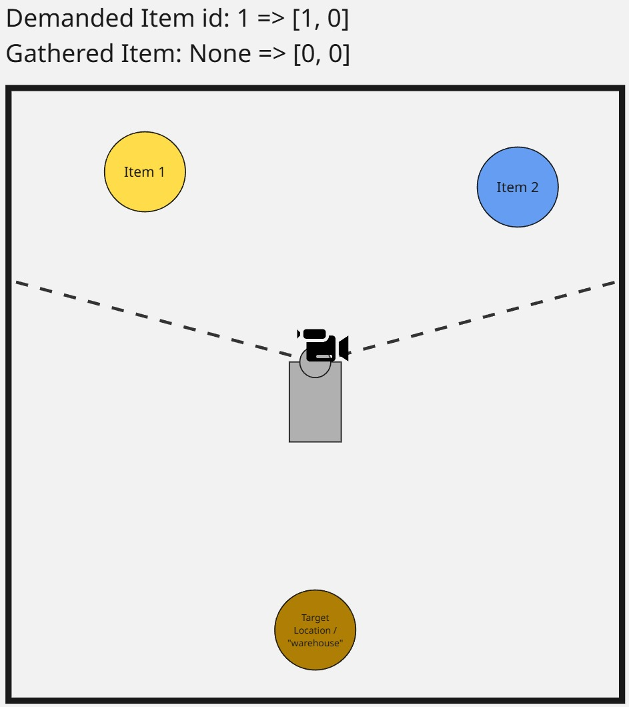
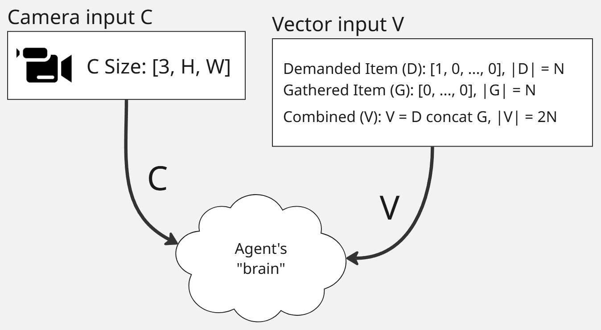
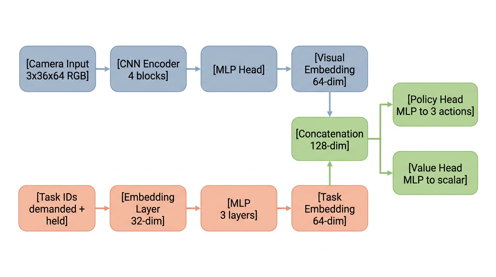

# Warehouse Bot Training

Training system for the [Warehouse Bot](https://github.com/Pawcharz/warehouse-bot) — a deep reinforcement learning agent that learns to navigate a 3D warehouse environment, find specific items, and deliver them to a deposit location. Built from scratch using **PyTorch** with a custom **PPO** (Proximal Policy Optimization) implementation, designed to work with **Unity ML-Agents** environments.

This project was developed as an engineering thesis at Gdansk University of Technology (2025).

## Overview

The agent receives visual input from a head-mounted camera (64x36 RGB, 120 FOV) and task-specific vector observations (demanded item + held item IDs). It learns through a 2-stage curriculum:

1. **Stage 1 — Room_Find**: The agent learns to navigate to the correct item out of 2, using camera observations and task embeddings. A CNN+MLP multimodal architecture processes visual input alongside learned task representations.
2. **Stage 2 — Room_Find_Deliver**: The pre-trained Stage 1 model is fine-tuned to also deliver the found item to a deposit location, leveraging previously learned visual and navigation features.

<p align="center">
  
  
</p>

### Results

| Task | Training Iterations | Simulation Steps | Success Rate |
|---|---|---|---|
| Room_Find | 225 | 471,103 | 100% |
| Room_Find_Deliver | +325 (550 total) | +679,396 (1,150,499 total) | 96% |

The final agent achieves a 96% delivery success rate with 0% wall collisions, trained entirely with sparse rewards (no shaping).

### Key Features

- **Custom PPO implementation** with GAE (Generalized Advantage Estimation), value clipping, and reward normalization
- **Multimodal actor-critic architecture**: CNN visual encoder + learned task embeddings with feature-level concatenation fusion
- **Intrinsic Curiosity Module (ICM)** for curiosity-driven exploration in sparse-reward environments
- **Curriculum learning** — transfer from simple to complex tasks
- **Architecture ablation study** with configurable CNN depth and embedding dimensions
- **PPO validation** against Stable-Baselines3 on standard Gymnasium benchmarks
- **WandB integration** for experiment tracking (metrics, losses, gradients, weight distributions, heatmaps)
- **Early stopping** based on evaluation performance
- **Reproducibility** through comprehensive seed management

---

## Project Structure

```
warehouse-bot-training/
│
├── config.py                           # Root directory configuration
├── run_training.py                     # Main training entry point
├── run_evaluation.py                   # Main evaluation entry point
├── run_ablation_study.py               # Ablation study entry point
│
├── src/
│   ├── algorithms/
│   │   ├── PPO_algorithm.py            # Custom PPO (GAE, RolloutBuffer, training loop)
│   │   └── RewardsNormalizer.py        # Running mean/std reward normalization
│   │
│   ├── environments/
│   │   ├── env_utils.py                # Environment factory (creates Unity envs with wrappers)
│   │   ├── env_multimodal_gymnasium_wrapper.py  # Gymnasium wrapper for camera+vector obs
│   │   └── env_vector_gymnasium_wrapper.py      # Gymnasium wrapper for vector-only obs
│   │
│   ├── models/
│   │   ├── actor_critic.py                        # MLP Actor-Critic (PPO validation)
│   │   ├── actor_critic_multimodal_embedding.py   # CNN+Task Embedding Actor-Critic (main model)
│   │   ├── actor_critic_multimodal_configurable.py # Configurable variant (ablation study)
│   │   ├── intrinsic_curiosity_module.py          # ICM (forward/inverse models + wrapper)
│   │   ├── model_utils.py                         # Save/load checkpoints, parameter counting
│   │   └── icm_utils.py                           # Named parameter extraction for ICM
│   │
│   ├── trainings/
│   │   ├── custom_ppo_camera.py                     # Stage 1: Room_Find (camera observations)
│   │   ├── custom_ppo_camera_icm.py                 # Training with ICM curiosity
│   │   └── custom_ppo_delivery_from_pretrained.py   # Stage 2: Room_Find_Deliver (curriculum)
│   │
│   ├── evaluation/
│   │   └── evaluate_model.py           # Standalone model evaluation
│   │
│   └── utils/
│       ├── evaluation.py               # Shared policy evaluation function
│       ├── early_stopping.py           # Early stopping condition
│       ├── seed_utils.py               # Seed management for reproducibility
│       └── wandb_logger.py             # WandB logging (metrics, gradients, heatmaps)
│
├── experiments/
│   ├── ablation_study.py               # Architecture ablation (CNN depth, embedding dims)
│   └── sb3_custom_comparison/          # Custom PPO vs Stable-Baselines3 comparison
│       ├── ppo_comparison.py           # Multi-seed comparison on CartPole/Acrobot
│       └── README.md                   # Experiment documentation & results
│
├── saved_models/
│   └── custom/                         # Trained model checkpoints (.pth)
│
├── assets/                             # README images and diagrams
├── environment_builds/                 # Unity builds (git-ignored, see Setup)
├── requirements.txt
├── LICENSE
└── .env.example                        # WandB configuration template
```

---

## Architecture

### PPO Algorithm

The custom PPO implementation (`PPO_algorithm.py`) includes:

- **GAE** (Generalized Advantage Estimation) with configurable gamma and lambda
- **Clipped surrogate objective** as described in the original PPO paper
- **Value function clipping** to reduce critic training variability
- **Reward normalization** using running mean/std of discounted returns
- **Per-component learning rates** via parameter groups (visual encoder, task encoder, policy/value heads)
- **Learning rate scheduling** with StepLR
- **Gradient clipping** (max grad norm)
- **Optional ICM integration** for intrinsic curiosity rewards

### Multimodal Actor-Critic (main model)

The `ActorCriticMultimodal` architecture combines visual and task modalities:

<p align="center">
  
</p>

- **Visual encoder**: 4-block CNN (Conv2d → BatchNorm → ReLU → MaxPool) → 3-layer MLP with dropout and LayerNorm → 64-dim visual embedding
- **Task encoder**: Learned item embeddings (demanded item + held item) → 3-layer MLP with LayerNorm → 64-dim task embedding
- **Fusion**: Concatenation of visual and task embeddings (128-dim)
- **Policy head**: 3-layer MLP (128 → 64 → 3 actions: turn left, turn right, move forward)
- **Value head**: 3-layer MLP (128 → 64 → 1)

### Intrinsic Curiosity Module (ICM)

Optional wrapper for curiosity-driven exploration:
- **Inverse model**: Predicts action from (current, next) state features
- **Forward model**: Predicts next state features — prediction error = intrinsic reward
- Configurable eta (reward scaling) and beta (inverse vs. forward loss weight)

### Environment Wrappers

Unity ML-Agents environments are wrapped to conform to the Gymnasium API:
- **`UnityVectorGymWrapper`**: For vector-only observations
- **`UnityMultimodalGymWrapper`**: For camera + vector observations

---

## Setup

### Prerequisites

- Python 3.8+
- PyTorch (with CUDA recommended)
- Unity environment builds from the companion [warehouse-bot](https://github.com/Pawcharz/warehouse-bot) repository

### Installation

```bash
pip install -r requirements.txt
```

For the SB3 comparison experiment, additionally:
```bash
pip install stable-baselines3
```

### Environment Setup

1. **Build Unity environments** from the [warehouse-bot](https://github.com/Pawcharz/warehouse-bot) repository and place them in `environment_builds/`:
   ```
   environment_builds/
   └── stage2/
       └── <build_name>/
           └── Warehouse_Bot.exe
   ```

2. **Configure WandB** (optional but recommended) — copy `.env.example` to `.env` and fill in your credentials:
   ```bash
   cp .env.example .env
   ```

---

## Usage

### Training

Select the desired training script by editing the import in `run_training.py`, then:

```bash
python run_training.py
```

Available training scripts:

| Script | Description |
|---|---|
| `custom_ppo_camera` | Stage 1 — camera observations, Room_Find task |
| `custom_ppo_delivery_from_pretrained` | Stage 2 — delivery fine-tuning from pre-trained Stage 1 model |
| `custom_ppo_camera_icm` | Camera + ICM curiosity exploration |

Each training script contains its own hyperparameter configuration and specifies the Unity environment build path.

### Evaluation

```bash
python run_evaluation.py
```

Configure the model checkpoint and environment build paths inside `src/evaluation/evaluate_model.py`.

### Ablation Study

```bash
python run_ablation_study.py
```

Runs architecture configurations sequentially (3/4/5 CNN blocks, 16/32/64-dim embeddings). Results are logged to WandB.

### PPO Validation (SB3 Comparison)

```bash
python experiments/sb3_custom_comparison/ppo_comparison.py
```

Multi-seed comparison of custom PPO vs. Stable-Baselines3 on CartPole-v1 and Acrobot-v1.

---

## Hyperparameters

Default PPO settings used in training:

| Parameter | Value | Description |
|---|---|---|
| `gamma` | 0.99 | Discount factor |
| `gae_lambda` | 0.95 | GAE lambda |
| `clip_eps` | 0.2 | PPO clip range |
| `value_clip_eps` | 0.2 | Value function clip range |
| `epochs` | 4 | PPO update epochs per iteration |
| `batch_size` | 128 | Mini-batch size |
| `buffer_size` | 2048 | Rollout buffer size (timesteps per iteration) |
| `max_grad_norm` | 0.5 | Gradient clipping threshold |
| `loss_val_coef` | 0.5 | Value loss coefficient |
| `loss_entr_coef` | 0.01–0.015 | Entropy bonus coefficient |
| `visual_lr` | 1e-4 | Visual encoder learning rate |
| `task_lr` | 1e-4 | Task encoder learning rate |
| `general_lr` | 3e-4 | Policy/value head learning rate |

ICM-specific (when enabled):

| Parameter | Value | Description |
|---|---|---|
| `icm_loss_weight` | 0.1 | ICM loss weight in total loss |
| `icm_eta` | 0.01 | Intrinsic reward scaling |
| `icm_beta` | 0.6 | Inverse vs. forward loss balance |
| `intrinsic_reward_scale` | 0.05 | Intrinsic/extrinsic reward ratio |

---

## Saved Models

Model checkpoints (`.pth`) include model state dict, optimizer state, hyperparameters, seed, and evaluation metrics.

| Checkpoint | Description |
|---|---|
| `ppo_camera_120deg_0_20_100_find_2_items_train_1` | Stage 1 — Room_Find (pre-trained base model) |
| `ppo_camera_120deg_0_20_100_100_find_2_items_deliver_from_pretrained_1` | Stage 2 — Room_Find_Deliver (final model, 96% success) |

---

## Experiment Tracking

Training metrics are logged to **Weights & Biases**, including:

- **Training**: mean/std return, episode count, timesteps, time per iteration
- **Evaluation**: periodic deterministic policy evaluation (every 25 iterations, 100 episodes)
- **Losses**: total, policy, value, entropy (+ ICM losses when enabled)
- **Diagnostics**: per-component gradients, weight distributions, parameter update magnitudes, learning rates
- **Heatmaps**: agent visit frequency and direction distribution

---

## Related

- **[warehouse-bot](https://github.com/Pawcharz/warehouse-bot)** — Unity 3D warehouse environment with ML-Agents integration
